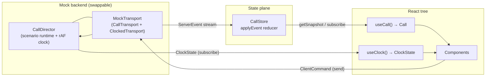

# Low-Level Design — Zoca Front Desk Console

How this repository works **right now**. Scope: the running front-end (there is no
server — the "backend" is a scripted mock that implements the same wire contract a
real one would). Companion docs: [`Components.md`](./Components.md) for the design
system inventory.

---

## 1. What the app is

A single-screen **live-call operator console**. The AI answers a salon's phone; a
human operator watches the transcript stream in, and at certain moments the AI
**hands a decision to the operator** (a low-confidence word, a slot choice, a
declined deposit, an escalation). The operator can also **take over** the line
entirely. The whole thing is driven off a scripted scenario so it demos
deterministically, but the data path is shaped exactly like a real websocket
backend so the mock can be swapped out without touching the UI.

**Stack:** React 19 + TypeScript (bundler mode), Vite 8, Tailwind v4 (`@theme
inline` tokens), `radix-ui` primitives, `react-router-dom` (HashRouter, mobile
only), Vitest + Testing Library, Cypress (e2e), Storybook 10. No global state
library — state is a hand-rolled external store consumed via
`useSyncExternalStore` (see §5).

---

## 2. The core idea: two independent planes

Everything follows from one decision — **the call is modelled as two separate
streams**, not one:

| Plane | Carries | Type | Source of truth | Consumed by |
|---|---|---|---|---|
| **Control / data** | discrete facts: transcript lines, agent steps, checkpoints, booking state | `ServerEvent` → `Call` | `CallStore` (`src/store/callStore.ts`) | `useCall()` |
| **Media / timing** | continuous playback: elapsed, progress, amplitude | `ClockState` | `ClockController` (`CallDirector`) | `useClock()` |

They never share state. A checkpoint pausing the agent does **not** stop the clock
(a live call keeps running while the operator thinks); the clock advancing does not
by itself change `Call` (events do). In production these would be a WebSocket and an
audio stream respectively. This separation is the single most important thing to
understand about the codebase.



---

## 3. The wire contract (`src/types/call.ts`)

The seam between UI and backend. Both the mock and any real server speak only
these types.

- **`ServerEvent`** (server → client): `call.state`, `turn.started`,
  `turn.status`, `transcript.line`, `transcript.delta`, `transcript.final`,
  `step.started`, `step.updated`, `recommendation.updated`, `slot.taken`,
  `payment.result`, `booking.confirmed`, and the human-in-the-loop pair
  `input.requested` / `input.cleared`.
- **`ClientCommand`** (client → server): `takeOver`, `release`, `endCall`, `mute`,
  `speaker`, `correctWord`, `selectSlot`, `requireDeposit`, `chargeDeposit`,
  `waiveDeposit`, `confirmBooking`, `refreshAvailability`, `operatorBook`, plus the
  "slower/safer" branches (`askCaller`, `readBack`, `askForCard`,
  `scheduleCallback`, `sendBookingLink`) and caller-dropped recovery (`callBack`,
  `holdAndText`, `releaseSlot`).
- **`Call`** — the whole client state: `connected`, `recording`,
  `operatorInControl`, `muted`, `speakerOn`, `feed: FeedItem[]`, `slots`,
  `selectedSlotId`, `draft`, `pending?: PendingInput`, `ended`.
- **`FeedItem`** — the single merged conversation feed (the app is a one-column
  design): a discriminated union of `utterance | turn | notice`. This is why
  transcript, agent traces, and system notices all interleave in render order.
- **`InputRequest`** — describes what a checkpoint needs (`correctWord`,
  `selectSlot`, `confirmBooking`, `payment`, `handoff`, `callerDropped`); it drives
  which checkpoint UI renders.
- **Transport interfaces:** `CallTransport` (`connect/close/subscribe/send`) and
  `ClockedTransport extends CallTransport` (adds `clock: ClockController`). The mock
  implements the clocked one; a real deployment would implement `CallTransport` and
  feed the clock from the audio element.

---

## 4. Module map

```
src/
  types/call.ts          The wire contract + Call + Clock interfaces (§3)
  store/
    callStore.ts         CallStore class + applyEvent + applyCommandOptimistic (§5)
    CallProvider.tsx     Creates the store per-mount, injects via context, connects (§5)
    callContext.ts       createContext<CallStore | null>  (DI only)
    clockContext.ts      createContext<ClockController | null>
  hooks/
    useCall.ts           useContext(store) + useSyncExternalStore  → Call
    useClock.ts          same shape for the clock  → ClockState + controls
    useKeyboardShortcuts.ts  global operator hotkeys (§10)
    useTheme.ts          light/dark on <html data-theme>, persisted
  mock/
    mockTransport.ts     MockTransport: CallTransport wrapper around the director (§8)
    director.ts          CallDirector: scenario runtime + rAF clock + gating (§8)
    scenarios.ts         Timeline/Gate DSL + the 10 authored scenarios (§8)
    salon.ts             static salon/customer fixture data
  lib/
    audio.ts             deterministic waveform generator + formatTime
    cn.ts                clsx + tailwind-merge
  components/            atoms / molecules / organisms / shared  (see Components.md)
  pages/
    ConsolePage.tsx      the whole console shell + HashRouter (§9)
    BookingPage.tsx      mobile /booking route (same store)
    CustomerPage.tsx     mobile /customer route
    RecordPanel.tsx      shared booking-record renderer
    bookingRecord.ts     deriveBookingRecord() — the dependency rule (§9)
    callSummary.ts       deriveCallSummary()
  App.tsx                picks Showcase (?demo) or the console; owns scenario/runId
  main.tsx               React root
  styles/tokens.css      the design-token ramps (light + dark)
```

---

## 5. State plane — `CallStore`

**Not** Redux/Zustand and **not** Context-as-state. It's a small subscribable
external store consumed through React's built-in `useSyncExternalStore`.

```
CallStore (class, src/store/callStore.ts:244)
  state: Call
  listeners: Set<() => void>
  getSnapshot()  → state
  subscribe(l)   → add/remove listener
  send(cmd)      → optimistic local update + transport.send(cmd)
  dispatch(e)    → setState(applyEvent(state, e))   (from transport.subscribe)
```

- **`applyEvent(call, event)`** — a **pure reducer** folding one `ServerEvent` into
  the next `Call` (immutable spread). All the feed-mutation logic lives here
  (appending turns, patching a step by id, marking a slot taken, opening/closing
  `pending`).
- **`applyCommandOptimistic(call, cmd)`** — pure; applies the operator's action
  locally *before* the backend echoes it, so mute/take-over/correct feel instant.
  The transport still gets the command and may emit authoritative events.
- **Reactivity:** `setState` swaps the object reference and calls every listener.
  `useSyncExternalStore(store.subscribe, store.getSnapshot)` re-renders subscribers.

**Context is dependency injection only.** `CallProvider` (`CallProvider.tsx:20`)
does `useMemo(() => new CallStore(transport))`, connects on mount / destroys on
unmount, and puts the **stable store instance** (not the changing `Call` value)
into `CallStoreContext`. That's what avoids the classic Context re-render problem
and why per-mount reset, fake-transport tests, and multiple consoles all work.

> Tradeoff worth knowing: `useCall()` returns the **whole** `Call` with no selector,
> and `getSnapshot` returns a fresh object per event, so every subscriber re-renders
> on every event. A `useCall(selector)` overload (Zustand-style) is the natural
> optimization if transcript-delta churn ever matters.

---

## 6. Media plane — the clock

`ClockController` (`getState/subscribe/play/pause/toggle/seek`) is implemented by
`CallDirector` itself, and surfaced through `useClock()` the same way `useCall`
surfaces the store. `ClockState` is `{ elapsed, duration, progress, level, playing,
ended }`. `level` is sampled from a **deterministic** pseudo-random waveform
(`lib/audio.ts`, `mulberry32` seed) so the bars are stable per call and identical
across reloads/tests. The waveform component and transport read only this plane.

---

## 7. The mock backend

Two classes stand in for "the server":

- **`MockTransport`** (`mock/mockTransport.ts`) — the thin `ClockedTransport`. It
  owns a `CallDirector`, forwards subscribers, routes `send(cmd)` to
  `director.onCommand`, and exposes `director` as its `clock`. `connect()` is a
  no-op — the demo is started from the UI, nothing auto-plays.
- **`CallDirector`** (`mock/director.ts`) — the real engine: a real-time rAF clock
  **plus** the agent-graph runtime.

### 7.1 How emission works

At construction the director builds the scenario into a sorted `TimelineItem[]`
(each `{ delay, event, gate? }`). A `requestAnimationFrame` loop advances `elapsed`;
`advance()` emits every item whose `delay <= elapsed`, in order. The clock free-runs
(a live call never stops) and updates `ClockState` each tick.

### 7.2 Checkpoints = **gated emission**, not a paused clock

When `advance()` reaches an item carrying a `gate`, the director:
1. emits `input.requested` (with the gate's `InputRequest`, plus the `turnId/stepId`
   it blocks), and
2. sets `suspended = true` — **agent emission stops, but the clock keeps ticking.**

It stays suspended until `onCommand(cmd)` receives a command matching the gate's
`await` / `awaitAlt` / `awaitThird`. Then it emits the resolver events (or
`onResolveWithInput(chosenWord/slot, cmd)` so the operator's choice propagates into
later steps), emits `input.cleared`, and **rebases the remaining timeline** by how
long the operator took (`rebaseRemaining`) so the rest of the call resumes with its
authored pacing. "Slower/safer" branches authored as relative `beats(...)` are
merged onto the live timeline (`scheduleBeats`) and play out one beat at a time.

`takeOver` clears any open gate and suspends the agent (clock still runs);
`release` un-suspends and resumes; `endCall` closes the gate, stops the clock, and
sets `ended`.

### 7.3 The scenario DSL (`mock/scenarios.ts`)

Scenarios are authored with a tiny fluent `Timeline` (`at`, `gateAt`, `step`,
`say`) and the `beats()` helper for gate branches. A `Gate` declares `await`, the
`request` shown to the operator, and one-to-three resolver branches. There are
**nine scenarios** (`happy` is the default): `happy`, `low-confidence`,
`slot-lost`, `payment-declined`, `caller-dropped`, `staff-conflict`,
`no-availability`, `availability-glitch`, `service-down`. `App.tsx` owns the
selected `scenarioId` and
a `runId`; bumping `runId` remounts `CallProvider` with a fresh `MockTransport`,
which is how "restart / switch scenario" resets everything cleanly.

---

## 8. End-to-end flow of a checkpoint

```mermaid
sequenceDiagram
  participant Dir as CallDirector (rAF)
  participant MT as MockTransport
  participant St as CallStore (applyEvent)
  participant UI as InlineCheckpoint / Feed
  participant Op as Operator

  Dir->>MT: advance() hits a gated item
  MT->>St: input.requested {request, turnId, stepId}
  St->>St: applyEvent → call.pending = {...}
  St-->>UI: notify → re-render
  UI-->>Op: renders the matching checkpoint (buildDecision on pending.request)
  Note over Dir: clock keeps ticking; agent emission suspended
  Op->>UI: picks an option
  UI->>St: send(ClientCommand)  (e.g. correctWord)
  St->>St: applyCommandOptimistic (instant local update)
  St->>MT: transport.send(cmd)
  MT->>Dir: onCommand(cmd) resolves the gate
  Dir->>MT: onResolve events… then input.cleared
  MT->>St: applyEvent (…, pending=undefined)
  Dir->>Dir: rebaseRemaining(waited) → resume timeline
```

`InlineCheckpoint` (organism) reads `call.pending` and builds the decision from the
`InputRequest` kind. Pressing **Esc** at any checkpoint = take over (the safe
fallback). The presentational variants (`WordCheckpoint`, `ConfirmCheckpoint`,
`PaymentCheckpoint`, `HandoffCheckpoint` in `components/shared/checkpoints.tsx`) are
what the Storybook stories exercise directly.

---

## 9. Rendering layer

**Components** are grouped `atoms / molecules / organisms / shared` (see
`Components.md` and the component-grouping note). Barrels export each group;
app-level code imports from the barrel, intra-`components` code uses deep paths.

**`ConsolePage.tsx`** is the shell. It:
- mounts `CallProvider` with a `MockTransport(scenarioId)`;
- runs a **`HashRouter`** with three routes — `/` (the console), `/booking`,
  `/customer`. Desktop shows everything in one layout (left `CustomerRail`, center
  feed, right booking rail — the right rail is resizable via `leftWidth`); on mobile
  (`< 1024px`) the customer/booking rails become the `/customer` and `/booking`
  routes instead, navigated to from tap targets;
- composes the **single feed** (`Feed`, memoized): maps `call.feed` items to
  `TranscriptLine` / `AgentTrace` / notices / `InlineCheckpoint`;
- wires `useKeyboardShortcuts`, `useTheme`, the end-call `Modal`, and the demo rail.

**Derived selectors keep components dumb.** `deriveBookingRecord(call, customer)`
(`pages/bookingRecord.ts`) computes the booking rail's state from `Call` — including
the **dependency rule**: fields stay withheld until the relevant agent step has
succeeded (intent → capability → availability → deposit/confirm), and Confirm is
disabled until everything upstream is certain. `deriveCallSummary` builds the
end-of-call receipt. Nothing in the view holds its own copy of call state — it all
derives from the store, per the shared-state model in the design docs.

Both mobile pages (`BookingPage`, `CustomerPage`) read the **same store** through
the same hooks, so they stay live with the desktop console — no prop drilling, no
duplicated state.

---

## 10. Cross-cutting concerns

- **Theming** — `useTheme` sets `data-theme` on `<html>`, persists to
  `localStorage`, defaults to OS preference. Tokens in `styles/tokens.css` swap both
  ramps; components reference tokens by role name only (no per-component theme
  branching). Storybook toggles the same attribute.
- **Keyboard** — `useKeyboardShortcuts` binds once and reads latest handlers via a
  ref (never re-binds, never stale). It stands down while a modal/checkpoint is open
  (that surface owns the keyboard), ignores typing targets and modifier combos.
  `SHORTCUT_GROUPS` is the single source rendered by `ShortcutsDialog`.
- **Accessibility** — `LiveAnnouncer` (atom) provides an `aria-live` region for
  call-state changes; checkpoints move focus; the waveform is keyboard-seekable.
- **Styling** — `cn()` = `clsx` + `tailwind-merge`; Tailwind v4 with `@theme inline`
  mapping semantic tokens to utilities.

---

## 11. Key design decisions & tradeoffs

| Decision | Why | Cost |
|---|---|---|
| Two planes (events vs clock) | Mirrors a real websocket + audio stream; a checkpoint can freeze the agent without freezing the live call | Two subscription hooks to reason about |
| Hand-rolled external store over Zustand | Store is a **transport-bound protocol client** with a connect/destroy lifecycle, created per-mount and injected — not a global singleton; zero deps | No built-in selectors → coarse re-renders (§5) |
| Context = DI only | Avoids the Context re-render anti-pattern while keeping per-instance stores testable | One extra provider layer |
| Single merged `feed` union | The design is one column; interleaving transcript/steps/notices falls out naturally | Feed items are a discriminated union to narrow everywhere |
| Scenario DSL + gated emission | Deterministic, authorable demos that exercise the exact same code path as a real backend | Scenario files are verbose |
| Derived selectors (`deriveBookingRecord`) | Enforces the dependency rule in one pure, tested place | Recomputed per render |

---

## 12. Testing

- **Unit (Vitest + Testing Library):** pure reducers (`applyEvent`,
  `applyCommandOptimistic`), the director's gating/rebasing (`director.test.ts`),
  `deriveBookingRecord` / `deriveCallSummary`, and per-component tests co-located as
  `*.test.tsx`.
- **e2e (Cypress):** full scenario walk-throughs against the dev server.
- **Storybook:** every component has stories (states + light/dark + viewports);
  `InlineCheckpoint` stories feed a stub `CallStore` with a hand-built `pending`.

---

## 13. How to extend it

- **Swap the mock for a real server:** implement `CallTransport`
  (`connect/close/subscribe/send`) over a WebSocket, feed the clock from the audio
  element (or implement `ClockedTransport`), and pass it to `CallProvider`. Nothing
  in the components or store changes — they only know the wire types.
- **Add a scenario:** author a `Timeline` in `scenarios.ts` (use `step`/`say`/
  `gateAt` + `beats` for branches) and add it to the `scenarios` array; it appears in
  the demo rail automatically.
- **Add a component:** drop it in the right group folder, add one `export *` line to
  that barrel, and follow the barrel-outside / deep-inside import rule.
- **Add an operator action:** add the command to `ClientCommand`, handle it in
  `applyCommandOptimistic` (optimistic UI) and in the director's `onCommand`/gate
  resolvers (backend echo).
```
